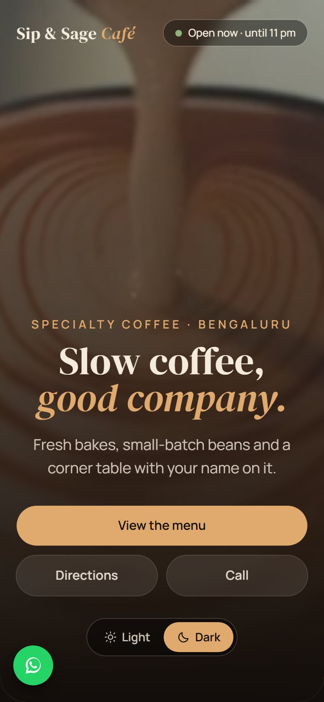
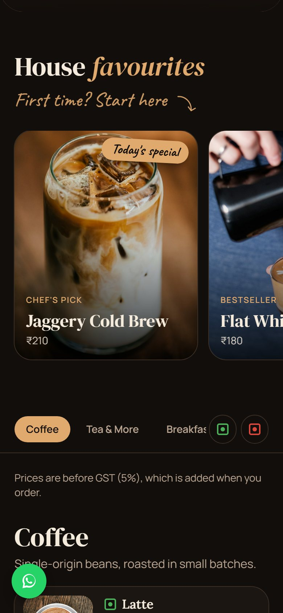
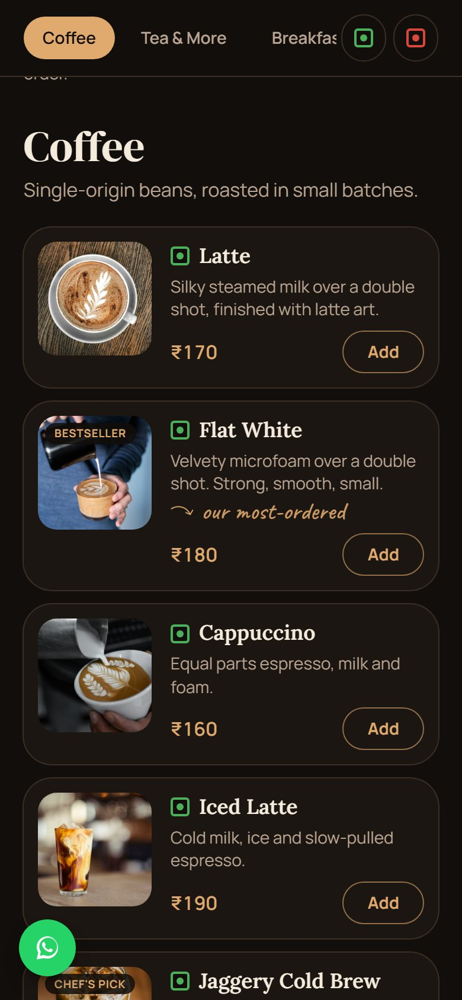
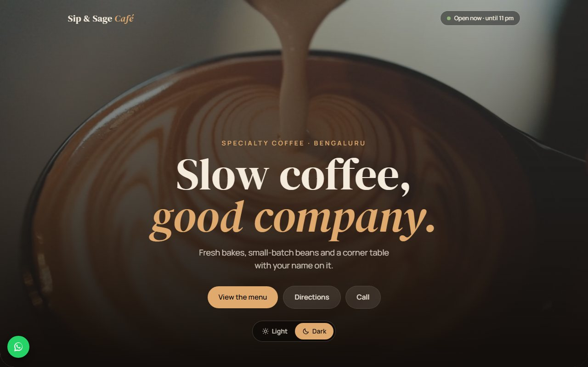
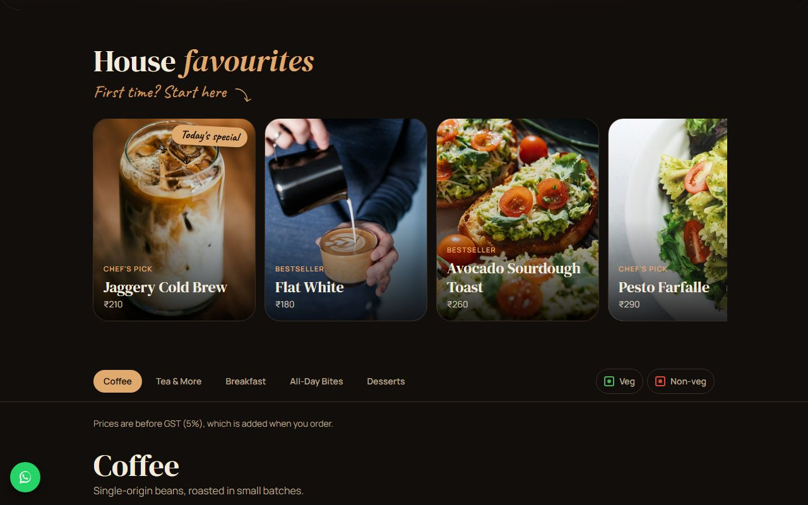

# Sip & Sage Café — Menu & Ordering

A mobile-first café website: a photo-led menu with veg / non-veg filters, a cart, a full "Your order" page and
per-table QR codes. Dark by default, with a light theme. Built with React 19, Vite 8 and Tailwind CSS 4.
No backend yet, so it hosts for free.

**Live demo: [sip-and-sage-cafe.vercel.app](https://sip-and-sage-cafe.vercel.app/)** (best viewed on a phone)

> A demo built to show real café owners what their own site could look like. Café name, story, photos and contact
> details are sample content.

## Screenshots

<p align="center">
  
  
  
  
</p>

<p align="center">
  
  
</p>

<p align="center">
  
  
</p>

## What it does

- Menu with photos, category tabs, house favourites (with a "Today's special" badge) and a tap-for-details view
- Veg / Non-veg filters
- Add to order, a floating cart bar, and a "Your order" page (table, notes, light suggestions, subtotal + GST + total)
- Per-table QR codes (`/#/qr`): each code carries `?table=N`, so the order knows where to be served
- Live "Open now" status from the opening hours
- Dark theme by default, with a light theme and a toggle (the choice is remembered on the device)
- An "Our story" page (`/#/about`) and a footer with visit and contact details

> **Demo mode:** "Place order" saves the order on the guest's device only (`src/lib/orders.js`).
> It is not sent to a kitchen yet. When an owner dashboard exists, only `submitOrder()` needs to change.

## Run

```bash
npm install
npm run dev      # http://localhost:5173
npm run build    # outputs /dist
```

## Reuse for another café

1. `src/config/cafe.js` — name, phone, WhatsApp, address, map link, hours, number of tables, tax rate
2. `src/data/story.js` — the "Our story" page. **The text is sample copy:** replace it with the real café's own story
3. `src/data/special.js` — which dish gets the "Today's special" badge (change it daily)
4. `src/data/menu.js` — categories, items, prices, diet (`veg` / `egg` / `nonveg`), optional `light: true` for suggestions
5. `public/images` — replace the photos (keep the file names, or change the `image` paths)
6. `src/index.css` — colours live in the `@theme` block at the top (dark), with the light palette just below it.
   Parts that sit on photos (hero, story card, visit section) use `.dark-scope` so they stay dark in both themes

## Table QR codes

Open `/#/qr` on the deployed site, set the menu address and the number of tables, then **Print cards**.

## Deploy

Netlify or Vercel, both free (the live demo is on Vercel). Build command `npm run build`, publish directory `dist`.

## Photos and video

The hero video (`public/video`) is a free Pexels clip. Phones get the small file, wide screens get the sharper one,
and anyone who prefers reduced motion sees the still photo instead. To change it, replace the two `.mp4` files
(keep them small: a hero video should be a few MB at most).

Photos are from [Unsplash](https://unsplash.com) (free to use). Credits are in the site footer and in
`photoCredits` in `src/data/menu.js`. For a real client, use the café's own photos.
